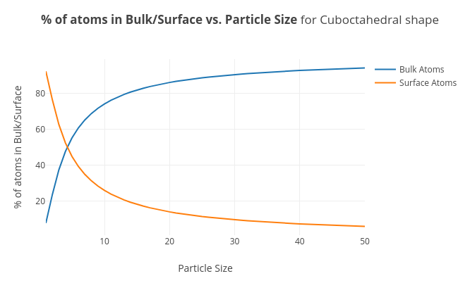

# Nanomaterials Assignment

**Note**: Open [index.html](./index.html) in browser to view the project from this folder, otherwise [click here](http://nano-mnn.herokuapp.com/)

## Students
| Names            | Roll No. |
|------------------|----------|
| M. Maheeth Reddy | 1801CS31 |
| M. Nitesh Reddy  | 1801CS32 |
| Nischal A        | 1801CS33 |

## Project Link
[Click here](http://nano-mnn.herokuapp.com/) to view the project

## Tech Stack
- HTML
- CSS
- JavaScript
- [Plotly.js](https://plotly.com/javascript/)

## Question 1
Write a computer programming to deduce the total number of atoms and surface atoms for different shell of cuboctahedral/spherical shape. Plot % of atoms in bulk/surface versus particle size. The user should get idea to generate the thickness or size of nanoparticle for a particular application (optical/electrical/magnetic/strength) 

## Implementation
### Inputs
1. Shape (Cuboctahedral/Spherical) 
2. Application (Optical/Electrical/Magnetic/Strength/None) 
3. Range of size of nanoparticle (default: 1-50 nm) 

### Output
Graph of % of atoms in Bulk/Surface vs. Particle Size for the chosen Shape and Application

### Workflow
First, a user <u>must</u> choose one of the shapes (Cuboctahedral/Spherical).
Then, the user can <u>optionally</u> choose one of the following applications. The nanoparticle sizes are mentioned below:

| Application | Radius Range (nm) |
|-------------|-------------------|
| Optical     | 40-100            |
| Electrical  | 10-20             |
| Magnetic    | 1-10              |
| Strength    | 1-50              |
| None        | User Choice       |

If the user doesn't want to choose any of the applications among Optical, Electrical, Magnetic, Strength, they can just select <u>None</u> and type custom range values for nanoparticle size.

Finally, the user can click the <u>Draw Graph!</u> button. 

### Code
The Code uses the following formulae:

Total Number of atoms in Cuboctahedral shape = (10k^3 + 15k^2 + 11k + 3)/3

Number of atoms on the surface of Cuboctahedral shape = (10k^2 + 2)

Total Number of atoms in Spherical shape = (10k^3 - 15k^2 + 11k - 3)/3

Number of atoms on the surface of Spherical shape = (10k^2 - 20k + 12)

where, *k* is the size of the atom

After the user gives the inputs, the application will apply the appropriate formulae to calculate the **% of surface atoms** for the **specified shape**. Then, this value is subtracted from 100 to get the **% of bulk atoms**. These percentages are calculated **for all particle sizes in the size range specified**.

Finally, a graph is plotted with these percentages on the Y-axis and particle sizes on the X-axis.

### Contributions
| Names            | Roll No. | Contribution |
|------------------|----------|--------------|
| M. Maheeth Reddy | 1801CS31 | JavaScript   |
| M. Nitesh Reddy  | 1801CS32 | HTML         |
| Nischal A        | 1801CS33 | CSS          |
